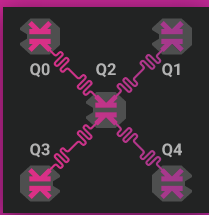
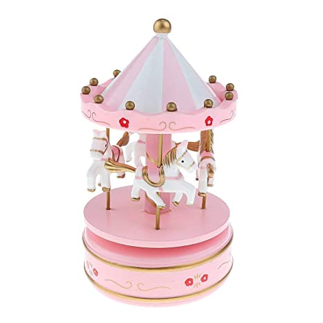
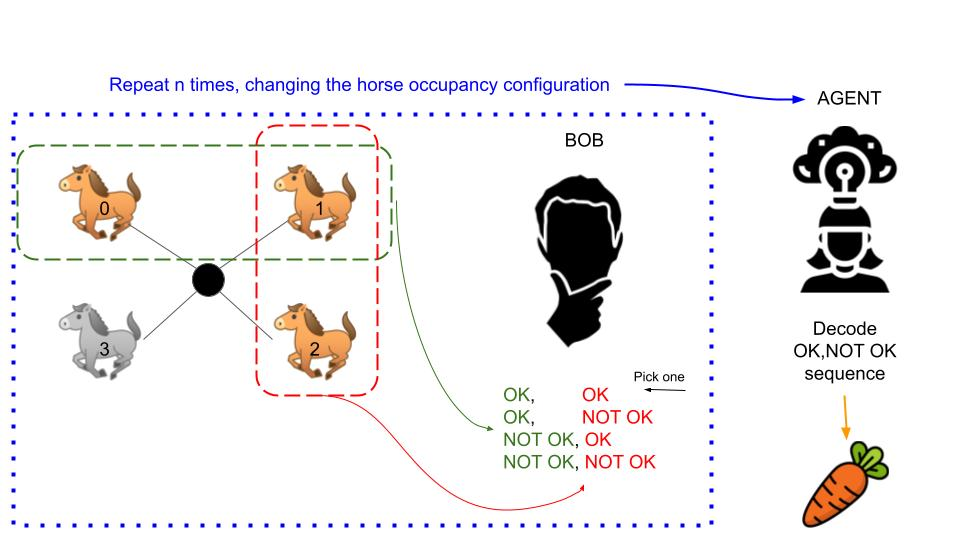
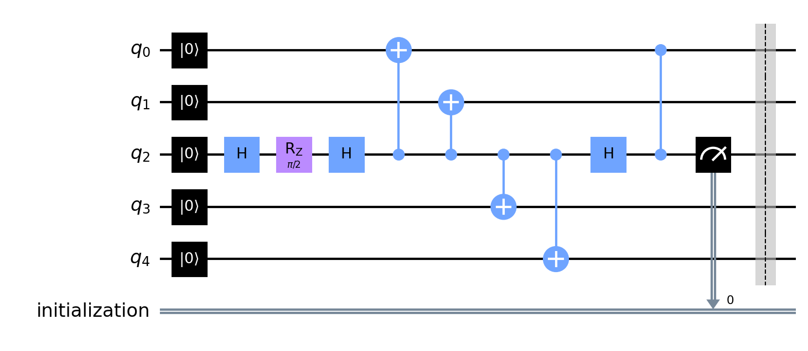
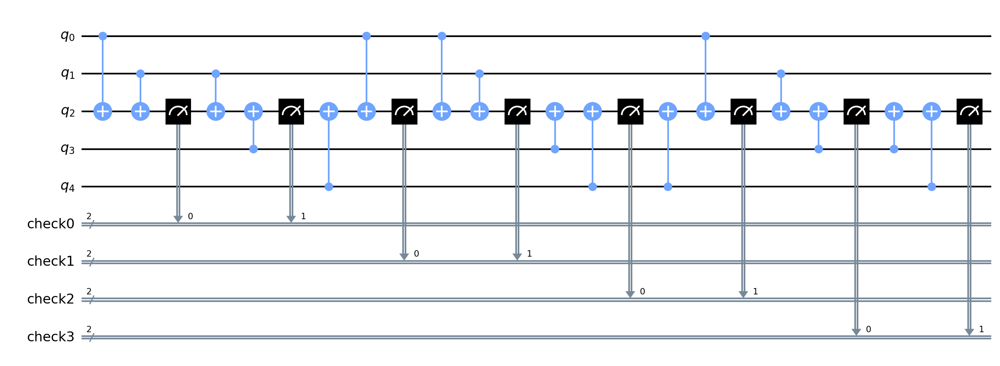

# Spinning carousel quantum memory

Our goal is to reproduce a quantum memory on the $5$-qubit QuTech device stardom. However, the approach we decided to follow is not implementable in the hardware at the moment since it requires intermediate measurement. We so decided to simulate the device-specific using qiskit density matrix simulator.
The work is inspired by [this paper](https://www.nature.com/articles/nature14270) and [this other paper](https://arxiv.org/pdf/2102.06132.pdf). However, they missed the flow of the music!
Here we report the topology of stardom:

**Team members**: Marco Ballarin, Alice Pagano, Marco Trenti

# Table of contents
1. [How the carousel works](#carousel)
2. [The quantum math behind the carousel](#math)
    1. [Preparing the carousel: the encoding](#encoding)
    2. [Listen to the horses: the parity checks](#parity_checks)
3. [Decoding the sequence: machine learning agent](#mlagent)
    1. [Dataset generation](#data_generation)
    2. [Machine learning model](#mlmodel)
    3. [Classical postprocessing](#clpostprocess)
4. [Aaand... the results!](#results)
    1. [Link to the presentation](#pres_link)
    2. [Personal experience? A carousel riding!](#exp)

## How the carousel works 

Do you remember those old festivals in which you would mount your fiery horse, and spin around while your parents were watching you? Well, here we go again (but quantum)!
We have four mighty horses.
Each time you buy a ticket you and your friends can mount up to three horses, and after each ride you must switch horse. Just to make sure you don't hurt the horses' feelings. So, the pattern of the ridden horses is:
- $0,1,2$
- $1,2,3$
- $2,3,1$
- $3,1,0$

At the end of each ride the occupied horses neigh. The one ridden in the middle actually makes two neighings! You know, first he answers the horse in front of him, and then the horse behind him. The free horse instead remains silent.

To me and you, all the horse noises seams the same. Really the same! But not to Bob, our *Parity checker* (yes, parity checker is a specific horce-racing term). He knows how to speak with horses, and by hearing two couple of neighings (first+second, second+third) he is able to understand if one of the horses is in distress! However, Bob cannot stop the carousel. He will write down who is in distress, and give him an extra carrot that evening!
Furthermore, by keeping one of the horses silent Bob is always able to understand who is in distress! It would be a mess to hear from all the horses at once. In particular, he would not be able to understand which horses are in distress if there are at least two.

Bob is good at understanding horses. But he is simple-minded, he need the help of his friend Agent to decode the pattern and understand who and how many carrots are needed!

So, what happens in a given ride is ($i$ is defined module 4):
1. The horses $i-1$, $i$, $i+1$ are mounted;
2. After the first ride $i$ calls, $i-1$ answers. Then $i$ calls again but $i+1$ answers. $i+2$ stays silent, since it has no mounters;
3. Bob writes down the horses' conversation: OK or NOT OK
4. The carousel restart, by changing places
At the end of the day, Agent decodes the (OK, NOT OK) sequence, and distribute the carrots accordingly. If the number of carrots received are the correct number we are all happy! 

**NOTICE**: no horses were hurted in this process

## The quantum math behind the carousel  
The project workflow is the following:
- Encode a general state 
    $$|\psi\rangle= \frac{1}{2}\big[ (1+e^{i\theta})|0\rangle + (1-e^{i\theta}|1\rangle \big]$$ 
    in the device, using $4$ physical qubits
- Measure repeatedly the state of the inner qubit, performing parity checks on 3 of the logical qubits. The set of three physical qubits spin around
- Save every measure that occurred during the simulation.
- Use a machine learning model to infer what happened and which are the needed actions to restore the correct state
- listen to fancy quasi-quantum music!

### Preparing the carousel: the encoding  
We encode, as an example, the state:
$$|\psi\rangle= \frac{1}{\sqrt{2}}\big[ |0\rangle -i |1\rangle \big]$$ 
into the state 
$$|\psi\rangle= \frac{1}{\sqrt{2}}\big[ |00s00\rangle -i |11s11\rangle \big]$$ 
in which $s\in\{0, 1\}$ is not important after the encoding. Below we show the encoding circuit. Notice that in this example and discussion we are showing the algorithm for the bit-flip. However, in the repository also the phase-flip algorithm is present.

### Listen to the horses: the parity checks  
Then we apply the parity checks, also called syndrome detection. We treat it as a "spinning" $3$ qubit code. This means that the parity checks, at a given step, will be on:
1. $q_0 q_1$, $q_1 q_3$.
2. $q_1 q_3$, $q_3 q_4$.
3. $q_3 q_4$, $q_4 q_0$.
4. $q_4 q_0$, $q_0 q_1$.

This spinning version of the $(3+1)$-qubit code increase our ability to correct the system with respect to a trivial $4$-qubit code. Indeed, we use only $3$ qubits at a given step. In that step, we may recognise an error BUT if a second error occurs in the $4^{th}$ qubit, even at the same time of the previous error, the new problem can be recognized in the next step! We are then able to correct up to $2$ errors instead of $1$, if the extra error occurs where we are not watching!
Below we report the table for the syndromes. The value 'n.a.' denotes a parity check that is not performed.

| $q_0q_1$  | $q_1q_3$ | $q_3q_4$ | $q_4q_0$ | Qubit with error |
|-----------|----------|----------|----------|------------------|
|  0        | 1        | n.a.     | n.a.     | $q_3$ |
|  1        | 0        | n.a.     | n.a.     | $q_0$ |
|  1        | 1        | n.a.     | n.a.     | $q_1$ |
|  n.a.     | 0        | 1        | n.a.     | $q_4$ |
|  n.a.     | 1        | 0        | n.a.     | $q_1$ |
|  n.a.     | 1        | 1        | n.a.     | $q_3$ |
|  n.a.     | n.a.     | 0        | 1        | $q_0$ |
|  n.a.     | n.a.     | 1        | 0        | $q_3$ |
|  n.a.     | n.a.     | 1        | 1        | $q_4$ |
|  1        | n.a.     | n.a.     | 0        | $q_1$ |
|  0        | n.a.     | n.a.     | 1        | $q_4$ |
|  1        | n.a.     | n.a.     | 1        | $q_0$ |

It may seem a little strange, but the figure will clarify it!

However, we stress that we don't do any classically controlled operation to update the results. It will be our machine learning model that, given the error pattern, will understand the correct **classical** post-processing!

## Decoding the sequence: machine learning agent  
To apply the machine learning model, first of all we have to define a task the ML model can understand and tackle. So, our task is to deduce the **error landscape** given the series of parity check measurements.
We define as error landscape a matrix with the qubit index on the rows ($y$ axis) and the time on the column ($x$ axis). Each time step is composed of the application of a single repetition of the parity check. The entries of the matrix are $0$ if no error occur, and $1$ if an error occur. 
We present below an example of such matrix where an error occurred at timestep $t_2$ on qubit $3$ and on timestep $t_3$ on qubit $0$:
| Qubit | $t_0$ | $t_1$ | $t_2$ | $t_3$ |
|-------|-------|-------|-------|-------|
| $q_0$ | $0$   | $0$   | $0$   | $1$   |
| $q_1$ | $0$   | $0$   | $0$   | $0$   |
| $q_2$ | $0$   | $0$   | $0$   | $0$   |
| $q_3$ | $0$   | $0$   | $1$   | $0$   |

### Dataset generation  
The generation of the dataset is a bit tricky. We cannot use real-device or simulator data, since in both cases we wouldn't have access to the error landscape, but only to the parity checks. For this reason, we prepare the dataset using a *correct* simulation where, before each parity check, we apply an $X=\begin{pmatrix}0 & 1 \\ 1 & 0\end{pmatrix}$ gate independently to each qubit with a probability $p$. In this way we have access to the full error landscape, that we can use as target state in our machine learning task. We select $p=10^{-2}$.
The learning procedure is however very though with the type of data we have available. We so preprocess the data, transforming each parity check measure in a number in $\{0, 1, 2, 3\}$ and the error landscape by "collapsing" each column into the qubit error index $+1$. If no error occur, then the value is $0$. For example, if an error occur on $q_1$ then the value will be $1+1=2$. We report the example of the error landscape of the previous section in the new form:
| $t_0$ | $t_1$ | $t_2$ | $t_3$ |
|-------|-------|-------|-------|
| $0$   | $0$   | $4$   | $1$   |

### Machine learning model: neural network 

### Classical postprocessing 
Given the error landscape we must be able to postprocess the data. This (at least) is very simple!
It is sufficient to compute the classical parity $\mathcal{P}$ of each row of the error landscape, and if the value is $1$ we flip the corresponding bit (if column $0$ has $\mathcal{P}=1$ then flip the value of $q_0$). We recall for completeness the definition of classical parity of a bit-string $\vec{x} = x_0x_1\dots x_n$:
$$
\mathcal{P}(\vec{x})=\left(\sum_ix_i\right)\%2
$$
which basically is $1$ if the number of $x_i=1$ is odd and $0$ otherwise.

## Aaand... the results! 

### Link to the presentation 
The presentation can be found [here]().

### Personal experience? A carousel riding! 
- **marcob** says: It was a very exciting experience! I'm settled in Italy, and so have a 6 hour lag w.r.t. ET timezone. However, the sheer excitment and the desire to overcome the challange let me continue to work until 3 am, and wake up at 7! I'm a PhD and I'm currently working on QECC, so the QuTech challange was really perfect for me. It was not trivial at all to come up with an interesting idea, but it was definitly fun! Btw, it was also my first hackaton ever.
- **alice** says:
- **marcot** says: